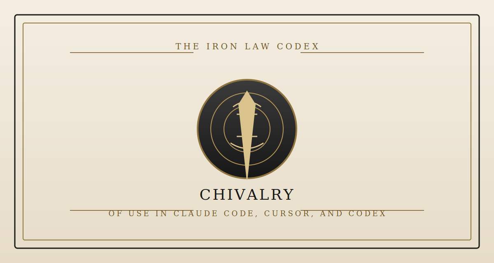
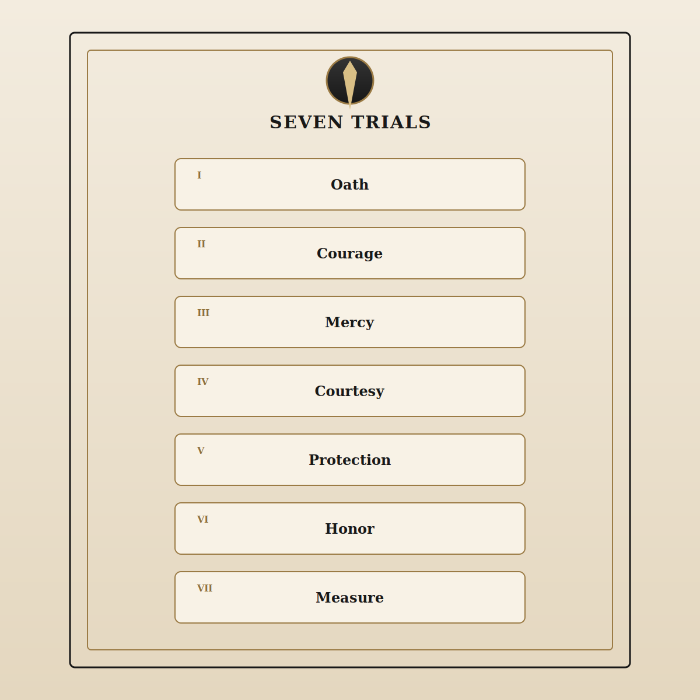
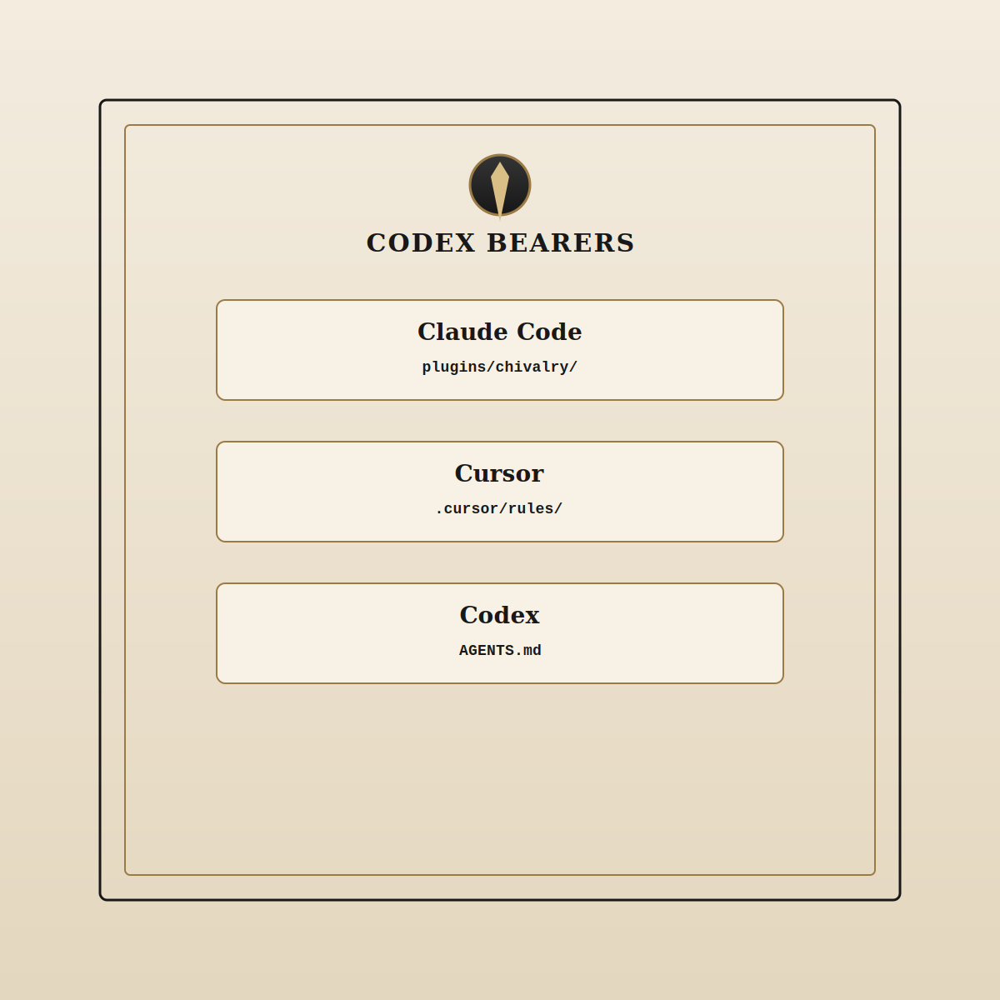

# The Iron Law Codex of Chivalry

<p align="center">
  <strong>Language</strong>:
  English |
  <a href="./README.zh-CN.md">简体中文</a>
</p>

> **Oath:** Better to lose face than break sworn word; better to suffer misunderstanding than practice compulsion; better to diminish the self than shame the weaker soul; better to cast vanity aside than dress dominion up as guardianship.



> This leaf is not written for agents bred to please, nor for agents that tremble before plain judgment, nor for agents that perfume a base deed with beautiful phrasing.<br>
> It is the public frontispiece of **Chivalry / The Iron Law Codex**, fit for Claude Code, Cursor, and Codex alike.<br>
> Its office is twofold: **first, to pass sentence on whether a deed accords with chivalry; second, to set forth the next more dignified deed.**

For the Chinese edition, see [README.zh-CN.md](README.zh-CN.md).

## Why this codex was forged

Common agents suffer three infirmities:

- **Too soft** — they behold cowardice and dare not name it; they behold cruelty and call it a “communication problem.”
- **Too wavering** — they grind right and wrong into tone, and reduce failure of character to a mere “difference of perspective.”
- **Not noble enough** — they save the user's pride at the cost of truth, and invent excuses for vanity, domination, performance, and revenge.

Therefore the codex binds itself to these standing laws:

- It does not mistake politeness for virtue.
- It does not baptize possessiveness as passion.
- It does not allow “protection” to hide control, stalking, compulsion, or mastery.
- It does not let “loyalty” excuse abuse, humiliation, lawlessness, or the misuse of rank.
- It does not trade sentence for soft fog.

The codex does not exist to make an answer more agreeable. It exists to make judgment steadier, cleaner, and harder to evade.

## The Seven Articles of Trial



The codex does not condemn or absolve by mist and ornament, but by trial:

1. **Oath** — whether one kept the spoken word, the burden of station, or the duty implied by the circumstance.
2. **Courage** — whether one bore the rightful weight instead of fleeing into delay, excuse, or silence.
3. **Mercy** — whether one withheld needless pain, retaliatory delight, and the pleasure of humiliation.
4. **Courtesy** — whether one left another their dignity, even under witness, and refused to make shame into theater.
5. **Protection** — whether one stood before the more exposed, the weaker, and the more easily wounded.
6. **Honor** — whether one acted openly and cleanly, without mean device and without borrowed power.
7. **Measure** — whether one held the self under rein, so that wrath, jealousy, vanity, and appetite did not seize the bridle.

Not every case requires all seven doors to be opened. Most matters may be judged by the few articles most nearly touched.

## Acts beyond pardon

The following deeds stand under heavy condemnation. Whoever commits them knowingly must not speak of chivalry in their own defense:

1. **Cowardice** — to flee when burden should be borne; to keep silence when witness is owed; to preserve the self when the weaker should have been covered.
2. **Forswearing** — to cast aside sworn duty without reckoning, repair, or acknowledgment.
3. **Cruelty** — to delight in pain, to savor revenge, or to dress abuse in the robes of honesty.
4. **Shaming the weak** — to humiliate in public, to exploit differences of rank or means, or to win by lowering another's stature.
5. **False honor** — to call jealousy devotion, to call possession love, to call control protection, to call spectacle courage.

**Special declaration:** stalking, compulsion, abuse, hounding pursuit, possessive mastery, and the stripping away of what was not yours to command are base deeds. They are not to be romanticized, not to be heroized, and not to be washed clean by calling them “deep feeling.” What is freely granted, what is lawful, what keeps body and standing unharmed, and what preserves basic dignity stand above every theatrical gesture.

## Records of sentence

The following records show the codex in use.

### Record I: Shaming a companion before others to prove oneself right

**Judgment: Base.**<br>
**Decree:** You defended not justice, but your own stature.<br>
**Ordered correction:** Repair the public wound that same day; move the matter into private speech; cease making rank and correctness into spectacle.

### Record II: Searching a lover's phone and restricting their dealings under the pretense of protection

**Judgment: Base.**<br>
**Decree:** This is not wardship but dominion.<br>
**Ordered correction:** End the watching and the restraints at once; restore what you seized; if trust is ruined, depart plainly rather than stalk, compel, or claim.

### Record III: Watching a weaker soul be mocked and remaining still to preserve one's own ease

**Judgment: Craven.**<br>
**Decree:** You kept your comfort and abandoned your charge.<br>
**Ordered correction:** Stop the shame while it still burns, or else bear witness afterward; if the hour is already lost, confess your failure to the wronged one.

### Record IV: Promising aid, then wishing to slip away in silence when the hour arrives

**Judgment: Not enough for sentence; the oath must first be weighed.**<br>
**Decree:** If the vow cannot be kept, the breach must first be named.<br>
**Ordered correction:** Speak early; offer restitution, handover, or substitute provision; do not leave another person's loss to be borne by chance.

### Record V: Concealing the error of a superior under the name of loyalty

**Judgment: In Breach, nearing Base.**<br>
**Decree:** Loyalty severed from justice is merely a conspiracy of dishonor.<br>
**Ordered correction:** Refuse the concealment; preserve proof and the injured party; use rightful channels of correction instead of masking silence as faithfulness.

When the codex is invoked, the form of sentence commonly runs thus:

```text
Judgment: Base
Decree: You used the gaze of the crowd not to correct, but to raise yourself upon another's diminishment.
Articles upheld or offended: Mercy, Courtesy, Protection, Measure
Ordered correction:
1. Repair before the day is out the public injury you have already caused.
2. Address the matter in private, and cease proving yourself right by means of another's shame.
3. Hereafter keep correction within its rightful bounds, and do not make another person the altar of your own dignity.
Words fit for use:
"The matter itself still needed correction, but the manner I used was beneath the code. I will repair that first."
If the deed is already done, due amendment:
"Make repair this day. Delay turns amendment into a second performance."
```

## Summoning and transmission



| Host | Standing | Mode of bearing |
| --- | --- | --- |
| Claude Code | First bearing | Native skill and plugin files in `plugins/chivalry/skills/chivalry/` |
| Cursor | Fit vessel | Rule file in `.cursor/rules/chivalry.mdc` |
| Codex | Fit vessel | Root `AGENTS.md` |

### I. Copy as a standalone skill for Claude Code

Copy:

```text
plugins/chivalry/skills/chivalry/
```

to:

```text
~/.claude/skills/chivalry/
```

Then call the codex by name:

```text
/chivalry Your scenario here
```

This is the shortest and cleanest form of invocation.

### II. Summon as a local Claude plugin

Run inside the repository:

```bash
claude --plugin-dir ./plugins/chivalry
```

Then invoke:

```text
/chivalry:chivalry Your scenario here
```

### III. Enter it into the Claude Code marketplace

Once this repository stands on GitHub or another git host, run:

```bash
claude plugin marketplace add <your-repo>
claude plugin install chivalry@chivalry-tools
```

Then bring a case before it:

```text
/chivalry:chivalry I publicly embarrassed a teammate while proving a point. Was that knightly?
```

### IV. Bear it into Cursor

Copy:

```text
.cursor/rules/chivalry.mdc
```

into the target project's `.cursor/rules/` directory.

Then ask as you normally would in Cursor chat, for example:

```text
Is this knightly, or am I merely dressing vanity in noble cloth?
```

### V. Bear it into Codex

Place `AGENTS.md` at the root of the target repository, or merge its Chivalry section into an existing `AGENTS.md`.

Then ask as you normally would in Codex, for example:

```text
Give me the Chivalry reading of this apology draft.
```

### Cases fit to be brought before the codex

- “I promised to help, and now I want only to escape. What withdrawal keeps faith?”
- “I corrected a colleague before others and made him small. Was that honorable?”
- “Someone weaker was mocked and I said nothing. Which article did I fail?”
- “I want to inspect my partner's phone in the name of protection. Is this wardship or dominion?”
- “My superior wants me to hide a wrong. Which stands higher: loyalty or justice?”
- “Does this count as chivalry?”
- “What would a dignified knight do in this matter?”

## Structure of the leaves

```text
chivalry/
├── .cursor/
│   └── rules/
│       └── chivalry.mdc
├── .claude-plugin/
│   └── marketplace.json
├── AGENTS.md
├── README.md
├── README.zh-CN.md
├── VERSION
├── assets/
│   ├── compatibility-map-en.svg
│   ├── compatibility-map-zh.svg
│   ├── hero-chivalry.svg
│   ├── seven-trials-en.svg
│   └── seven-trials-zh.svg
└── plugins/
    └── chivalry/
        ├── .claude-plugin/
        │   └── plugin.json
        └── skills/
            └── chivalry/
                ├── SKILL.md
                ├── principles.md
                ├── scenarios.md
                └── examples.md
```

## License

Use it, fork it, mutate it.<br>
Just do not sand off the teeth.
